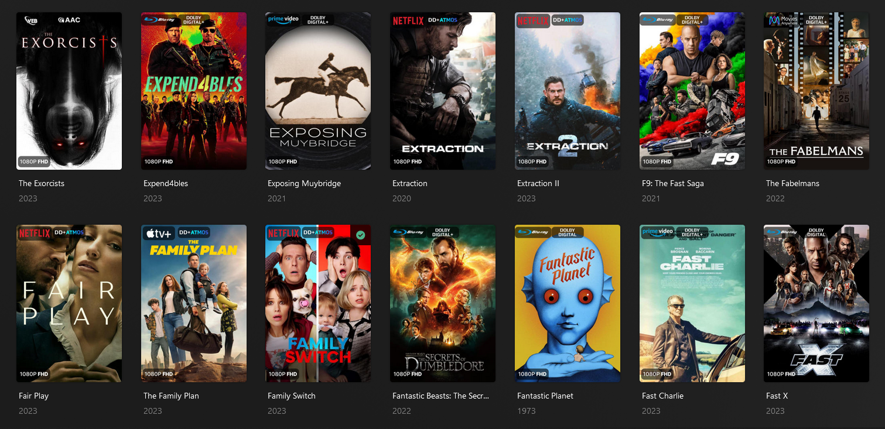

Add the following to the libraries you want to use this. By default, it will place the source from TRaSH naming scheme in top left.

    overlay_path:
    - file: /config/sources.yml
    - file: /config/season_sources.yml

You can easily add your own preferences and adjust - but I don't intend to do any of that work for you. That's part of Kometa.

There are extra Amazon and HBO Max png's in the folder you can swap out if you prefer them.

This will do show, individual seasons, and movies.

Don't add season_sources line if you don't want to do individual seasons.

Example images from my library - Please note I have a few extra TV sources that are not standard. It is easy to add any you wish with basic PMM overlay knowledge.

Thanks to bullmoose, anonfawkes, Mr. Carrot, Yozora, and the PMM Team and Discord in general, for PNGs and for helping me.
